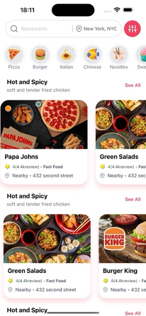
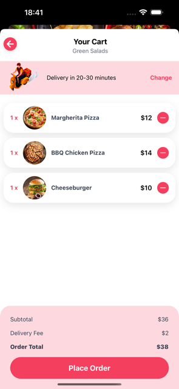
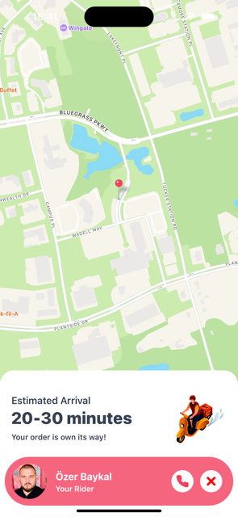
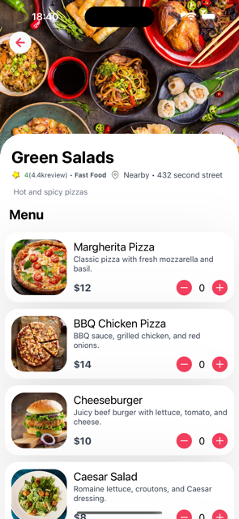

# Food Delivery App Native-Expo

## Project Description

Food Delivery App is a mobile application that allows users to order food from various restaurants. With a user-friendly interface, the app makes the food ordering experience easy and efficient.

## Video gif


## Home Screen



## Cart Screen



## Delivery Screen



## Restaurant Screen



## Features

- **User-Friendly Interface**: The app features a clean and easy-to-navigate design.
- **Screens**:
  - **Home Screen**: Displays a list of restaurants and allows users to start ordering food.
  - **Restaurant Screen**: Shows the selected restaurant's menu.
  - **Card Screen**: Allows users to manage their cart, including adding and removing items.
  - **Delivery Screen**: Shows delivery details for the current order.
  - **Order Preparing Screen**: Displays the preparation status of the order.
- **Add and Remove Products**: Users can add or remove items from their cart.
- **Total Price Display**: Shows the total price of all items in the user's cart.

## Technologies and Lİbraries Used

- React Native: Framework for building native mobile applications.
- Expo: Toolchain for developing and testing React Native applications quickly.
- React Native Wind: Tailwind CSS-like utility for rapid and flexible styling.

- react-native-feather: Modern and customizable icons.
- react-redux-toolkit :Stage Management

## Requirements

To run this project locally, you will need:

- Node.js: Download Node.js
- Expo CLI:

```
npm install -g expo-cli
```

- React Native CLI: (Ensure development environment is set up for iOS and Android)
- iOS: Xcode
- Android: Android Studio

## Installation

- Clone the project to your local machine:
  git clonehttps://github.com/ozerbaykal/Food-Delivery-Native-Expo.git

- Navigate to the project directory:

```
cd Food-Delivery-Native-Expo
```

- Install the necessary packages:

```
npm install
```

### Starting the Development Server

```
npm start

```

- Run on Emulator or Device:

### Use an Android or iOS emulator.

- Use an Android or iOS emulator.
- Alternatively, scan the QR code with your physical device using the Expo Go app.
<h2>Contributing</h2>

Contributions are welcome! Please open an issue first to discuss what you would like to change.

- 1.Fork the project
- 2.Create your feature branch (git checkout -b feature/NewFeature)
- 3.Commit your changes (git commit -m 'Add new feature')
- 4.Push to the branch (git push origin feature/NewFeature)
- 5.Open a Pull Request

<h2>Contact</h2>

Özer BAYKAL mail : baykalozer87@gmail.com

Project Link: https://github.com/ozerbaykal/Food-Delivery-Native-Expo/tree/main
